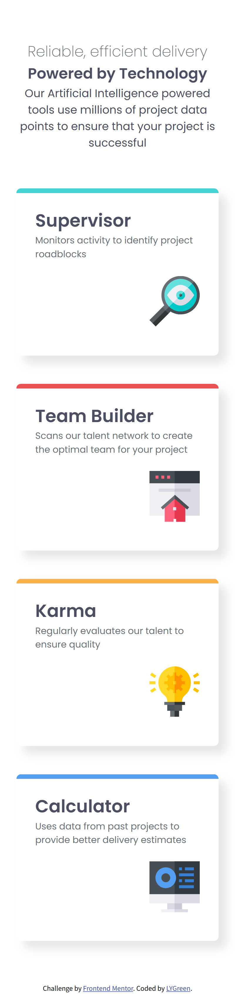

# Frontend Mentor - Four card feature section solution

This is a solution to the [Four card feature section challenge on Frontend Mentor](https://www.frontendmentor.io/challenges/four-card-feature-section-weK1eFYK). Frontend Mentor challenges help you improve your coding skills by building realistic projects. 

## Table of contents

- [Overview](#overview)
  - [The challenge](#the-challenge)
  - [Screenshot](#screenshot)
  - [Links](#links)
- [My process](#my-process)
  - [Built with](#built-with)
  - [What I learned](#what-i-learned)

## Overview

### The challenge

Users should be able to:

- View the optimal layout for the site depending on their device's screen size

### Screenshot




### Links

- Solution URL: [Add solution URL here](https://www.frontendmentor.io/solutions/four-card-feature-section-using-flexbox-and-grid-k4q92t0jvx)
- Live Site URL: [Add live site URL here](#)

## My process

### Built with

- Semantic HTML5 markup
- CSS custom properties
- Flexbox
- CSS Grid
- Mobile-first workflow

### What I learned

I learnt how to use grid and flexbox

```css
.feature {
    display: grid;
    /* ... */
}
```

```css
.supervisor {
    grid-column: 1 / 3;
    grid-row: 2 / 4;
}

.team-builder {
    grid-column: 3 / 5;
    grid-row: 1 / 3;
}

.kerma {
    grid-column: 3 / 5;
    grid-row: 3 / 5;
}

.calculator {
    grid-column: 5 / 7;
    grid-row: 2 / 4;
}
```

```css
.feature {
    display: flex;
    flex-direction: column;
    gap: 3rem;

    .card {
        display: flex;
        flex-direction: column;
        /* ... */

        img {
            align-self: flex-end;
            /* ... */
        }
    }
}
```
